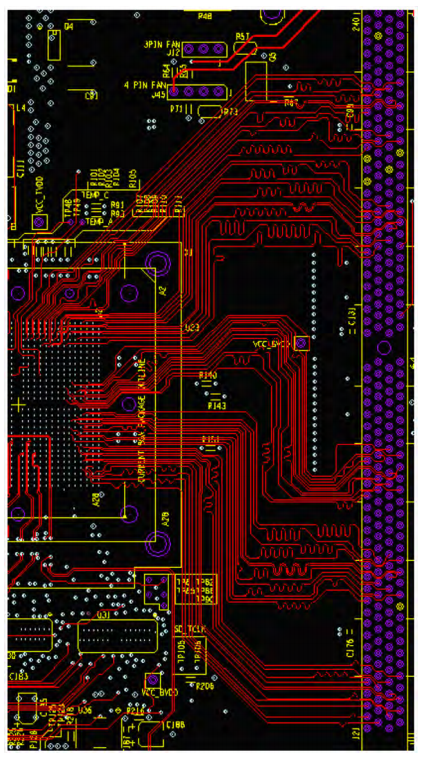

# Memory Technology

## Introduction: Why does memory architecture matter? **VIDEO**



This video describes why we're learning about memory architecture and shows an example of memory from a real (old) system.

Unfortunately, the video didn't show the board-level wires very well.
Here's a better picture.
On the left are the pins for the processor and on the right are the pins for the DDR (or similar) controller.
Here, you can see the squiggly lines that I was talking about to make sure that they are all the same length.

## Memory technology **VIDEO**



This video introduces the technology behind general memory arrays.

Here's a good picture, from wikipedia, showing what a set of DRAM banks looks like.
This is 1 mega*bit*.
Each square bank has 4 sub-arrays.
There are a total of 8*4=32 banks.
Each sub-array has 2^13 bits or 8192 bits.



This video talks about how SRAM and DRAM cells work.



This video looks at the characteristics we care about for memory technologies, and also talks about a few other storage-based technologies (Flash, disk, and 3D-XPoint).

## Moving data around **VIDEO**

Now that we've talked about how we want to have different places to store data, the next question is "what is the technology required to move data around?"



## **QUIZ** Memory technology

[Use gradescope to take the quiz.](https://www.gradescope.com/courses/105214/assignments/496443)

[Next up: Caches and the memory hierarchy](./caches.md)
